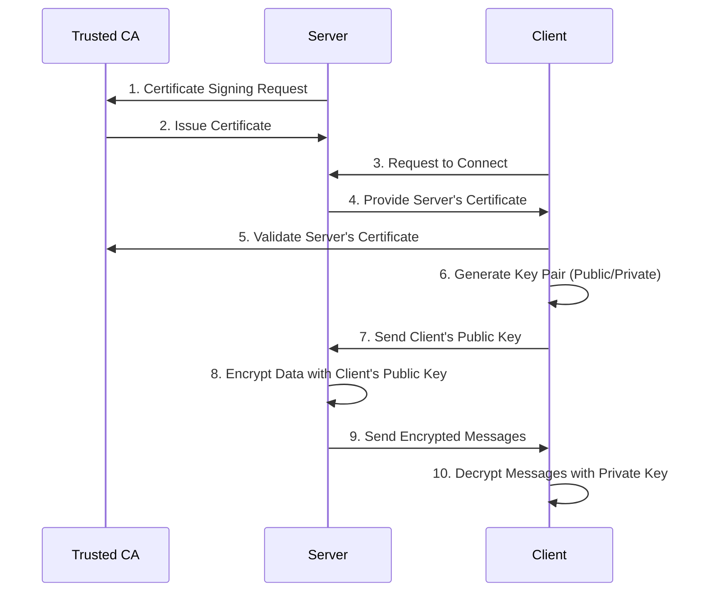

# Certificate Authority (CA) and TLS

Transport Layer Security (TLS) secures internet communication by encrypting traffic between client and server. Server identity is verified using a certificate issued by a trusted Certificate Authority (CA).

## Certificate Authority (CA)

## Transport Layer Security (TLS)
