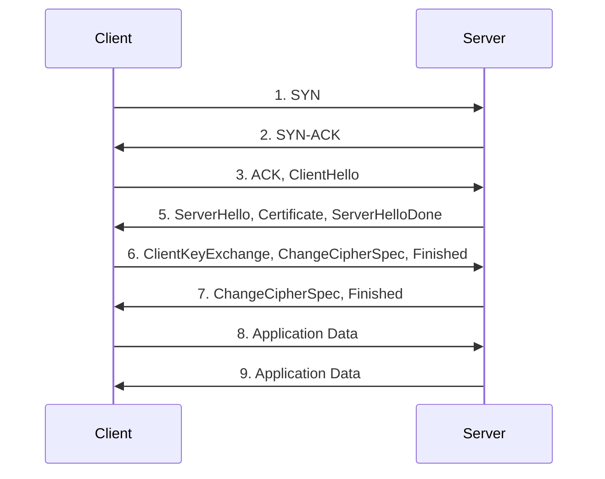

# Certificate Authority (CA) and TLS

Transport Layer Security (TLS) secures internet communication by encrypting traffic between client and server. Server identity is verified using a certificate issued by a
trusted Certificate Authority (CA).


## Certificate Authority (CA)

A Certificate Authority (CA) is a trusted organization (e.g. ISRG ROOT, Let's Encrypt) that issues digital certificates to verify the owner of a domain. When a client
accesses a server, the server provides its certificate. The client then validates the certificate by checking if the certificate is:

* signed by a trusted root CA or an intermediate CA that chains up to a trusted root CA  
* not expired based on its `NotBefore` and `NotAfter` fields  
* issued for the domain the client is trying to access by verifying the Subject Alternative Name (SAN) or, if absent, the Common Name (CN)  
* not revoked, using CRL (Certificate Revocation List) or OCSP (Online Certificate Status Protocol)  

Most modern operating systems and browsers maintain a set of trusted root CAs.

Example of a certificate chain:

```text
Root CA (e.g. ISRG Root X1)
├─── Intermediate CA (e.g. Let's Encrypt R3)
│    ├─── Server Certificate (e.g. hello-world-1.com)
│    └─── Server Certificate (e.g. hello-world-2.com)
└─── Intermediate CA (e.g. Let's Encrypt E1)
     ├─── Server Certificate (e.g. hello-world-3.com)
     └─── Server Certificate (e.g. hello-world-4.com)
```

### Tinkering with Certificates using OpenSSL

::: danger
Never expose a private key! The private keys and certs below are just some examples on how they look like.
:::

Below a short tinkering with OpenSSL to generate a Root CA, an Intermediate CA, and a Server Certificate which will work together. Note that the Root CA is self-signed
and browsers will not trust it unless it is added to the browser's trust store.

#### Generating a Root CA Certificate

CA certificate must have `CA:TRUE` to be able to sign other certificates. `keyCertSign` and `cRLSign` are required for signing other certificates.

```bash
openssl genpkey -algorithm RSA -out rootCA.key
openssl req -x509 -new -nodes -key rootCA.key \
    -sha256 -days 3650 -out rootCA.crt -subj "/CN=My Root CA" \
    -extensions v3_ca -config <(echo "[ v3_ca ]"; echo "basicConstraints = critical,CA:TRUE"; echo "keyUsage = critical, keyCertSign, cRLSign")
```

#### Generating an Intermediate CA Certificate

Intermediate CA is signed by the Root CA. The `CA:TRUE` and `pathlen:0` constraints are set to prevent the Intermediate CA from signing other CA certificates.

```bash
openssl genpkey -algorithm RSA -out intermediateCA.key
openssl req -new -key intermediateCA.key -out intermediateCA.csr -subj "/CN=My Intermediate CA"
openssl x509 -req -in intermediateCA.csr -CA rootCA.crt -CAkey rootCA.key \
    -CAcreateserial -out intermediateCA.crt -days 1825 -sha256 \
    -extensions v3_ca -extfile <(echo "[ v3_ca ]"; echo "basicConstraints = critical,CA:TRUE,pathlen:0"; echo "keyUsage = critical, keyCertSign, cRLSign")

# Certificate request self-signature ok
# subject=CN=My Intermediate CA
```

#### Generating a Server Certificate

`CA:FALSE` ensures that certificate can not act as CA. `serverAuth` ensures that the certificate is a valid server certificate.

```bash
openssl genpkey -algorithm RSA -out server.key
openssl req -new -key server.key -out server.csr -subj "/CN=example.com"
openssl x509 -req -in server.csr -CA intermediateCA.crt -CAkey intermediateCA.key \
    -CAcreateserial -out server.crt -days 365 -sha256 \
    -extensions v3_end -extfile <(echo "[ v3_end ]"; echo "basicConstraints = critical,CA:FALSE"; echo "keyUsage = critical, digitalSignature, keyEncipherment"; echo "extendedKeyUsage = serverAuth")

# Certificate request self-signature ok
# subject=CN=example.com
```

#### Playing with the Certificates

Validating the intermediate CA certificate:

```bash
openssl verify -CAfile rootCA.crt intermediateCA.crt

# intermediateCA.crt: OK
```

Verify if server certificate is valid and gets chained up to the Root CA:

```bash
openssl verify -CAfile rootCA.crt -untrusted intermediateCA.crt server.crt

# server.crt: OK
```

Get expiration date of server certificate:

```bash
openssl x509 -enddate -noout -in server.crt

# notAfter=Feb 19 15:41:31 2026 GMT
```

#### Bundling Certificates

To properly provide necessary certificates during the TLS handshake, the certificate chain must be bundled into one file. The `.pem` ending is often used for chains where
multiple certificates are bundled together.

```bash
cat server.crt intermediateCA.crt > server-chain.pem
```

This then can be used for example for a nginx web server:

```nginx
server {
    listen 443 ssl;
    server_name example.com;

    ssl_certificate /path/to/server-chain.pem;
    ssl_certificate_key /path/to/server.key;

    ssl_protocols TLSv1.2 TLSv1.3;
    ssl_ciphers HIGH:!aNULL:!MD5;
}
```

## Transport Layer Security (TLS)

TLS is often used to secure HTTP communication. A connection is initiated with a TLS handshake. During the handshake, the participants specify the TLS version for
communication, decide the cipher suites to use, authenticate the identity of the servers TLS certificate with the CA, and exchange session keys for further encrypted
communication. TLS ensures:

* Encryption: data is encrypted and can only be read by the meant recipient
* Authentication: ensures that the participants are who they claim to be
* Integrity: ensures that the data has not been tampered with



### Tinkering with TLS using OpenSSL

Below is an example of how to create a simple TLS server using OpenSSL. The server will listen on port 4433 and will use the server certificate and private key
generated above.

#### Simulating a TLS Server

Starting a simple TLS server which uses the certificate chain and private key.

```bash
openssl s_server -cert server-chain.pem -key server.key -accept 4433 -www

# Using default temp DH parameters
# ACCEPT
```

#### Connecting to the Server

By connecting to the server the server's certificate will be provided to the client.

```bash
# little hack for the local demo 
cat rootCA.crt intermediateCA.crt > ca-bundle.pem
openssl s_client -connect localhost:4433 -servername example.com -CAfile ca-bundle.pem
```

::: details Success Message

```text
Connecting to ::1
CONNECTED(00000005)
depth=2 CN=My Root CA
verify return:1
depth=1 CN=My Intermediate CA
verify return:1
depth=0 CN=example.com
verify return:1
---
Certificate chain
 0 s:CN=example.com
   i:CN=My Intermediate CA
   a:PKEY: rsaEncryption, 2048 (bit); sigalg: RSA-SHA256
   v:NotBefore: Feb 19 16:06:04 2025 GMT; NotAfter: Feb 19 16:06:04 2026 GMT
---
Server certificate
-----BEGIN CERTIFICATE-----

...

-----END CERTIFICATE-----
subject=CN=example.com
issuer=CN=My Intermediate CA
---
No client certificate CA names sent
Peer signing digest: SHA256
Peer signature type: RSA-PSS
Server Temp Key: X25519, 253 bits
---
SSL handshake has read 1382 bytes and written 402 bytes
Verification: OK
---
New, TLSv1.3, Cipher is TLS_AES_256_GCM_SHA384
Protocol: TLSv1.3
Server public key is 2048 bit
This TLS version forbids renegotiation.
Compression: NONE
Expansion: NONE
No ALPN negotiated
Early data was not sent
Verify return code: 0 (ok)
---
---
Post-Handshake New Session Ticket arrived:
SSL-Session:
    Protocol  : TLSv1.3
    Cipher    : TLS_AES_256_GCM_SHA384
    Session-ID: **SESSION-ID**
    Session-ID-ctx: 
    Resumption PSK: **RESUMPTION-PSK**
    PSK identity: None
    PSK identity hint: None
    SRP username: None
    TLS session ticket lifetime hint: 7200 (seconds)
    TLS session ticket:
    0000 - **SESSION-TICKET**

    Start Time: 1739983394
    Timeout   : 7200 (sec)
    Verify return code: 0 (ok)
    Extended master secret: no
    Max Early Data: 0
---
read R BLOCK
```

:::
