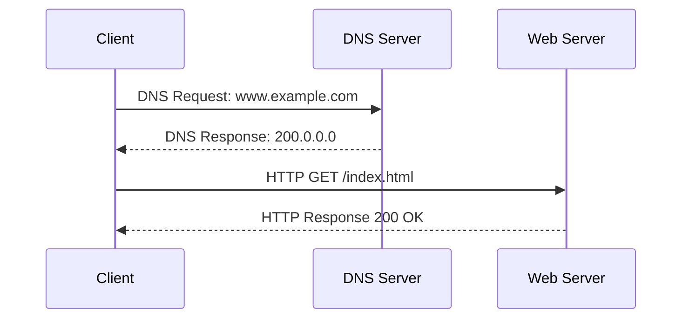

# DNS - Domain Name System

DNS is a system that translates domain names to IP addresses. This is used to route traffic via an human readable name to an ip address.

- DNS names are only used for human readability
- Servers use IP addresses to communicate with each other



### Zones

A DNS zone is a segment of the domain namespace managed by a specific organization or administrator. It consists of a collection of DNS records maintained by a DNS server. Zones enable different parts of a domain to be managed by separate DNS servers, providing flexibility and delegation in domain administration.

## DNS Records

DNS records are used to store information about a domain in a DNS zone file. General format of a DNS record:

```text
<name> <ttl> <class> <type> <rdata>
```

- `<name>`: the domain or subdomain
- `<ttl>`: time to live (how long the record is cached)
- `<class>`: the class of the record (IN for internet)
- `<type>`: the type of record (A for address)
- `<rdlength>`: length of the rdata field (internaly used)
- `<rdata>`: the IP address or data associated with the record

> [!INFO]
>
> - `<ttl>`, `<class>` and `<type>` are optional fields. If not specified, they will be set to default values.
> - `<rdlength>` is an internal field

### A and AAAA Records

A record is used to point a domain or subdomain to an IP address. A records are used for IPv4 addresses and AAAA records are used for IPv6 addresses.

```text
example.com 3600 IN A 200.0.0.0
example.com 3600 IN AAAA 2001:0db8:85a3:0000:0000:8a2e:0370:7334
```

### CNAME Record

CNAME record is used to point a domain or subdomain to another domain. The authoritative DNS server will resolve the CNAME record to the IP address of the target domain.

```text
www.example.com 3600 IN CNAME example.com
```

> [!WARNING]
>
> CNAME records cannot be used for root domains (apex) per [RFC 2181](https://www.rfc-editor.org/rfc/rfc2181#section-10).

### NS Record

NS record is used to indicate the authoritative DNS server for a domain. With NS records, multiple subdomains can be managed with different DNS zones.

```text
example.com 3600 IN NS ns1.google.com
example.com 3600 IN NS ns2.google.com
example.com 3600 IN NS ns3.google.com
example.com 3600 IN NS ns4.google.com
```

Often there are multiple NS records for a domain to provide redundancy and load balancing.

### MX Record

MX record is used to specify the mail servers that are responsible for receiving emails for a domain.

```text
example.com 3600 IN MX 10 mail1.example.com
example.com 3600 IN MX 20 mail2.example.com
```

The number (`10`, `20`) in the MX record is the priority of the mail server. Lower numbers have higher priority.

### Other Records

- **SOA Record**: Start of Authority record is used to specify the authoritative DNS server for a domain.
- **TXT Record**: Text record is used to store arbitrary text data.
- **PTR Record**: Pointer record is used for reverse DNS lookups.
- **CAA Record**: Certificate Authority Authorization record is used to specify which certificate authorities are allowed to issue certificates for a domain.
  ```text
  example.com CAA 0 issue "letsencrypt.org"
  ```
