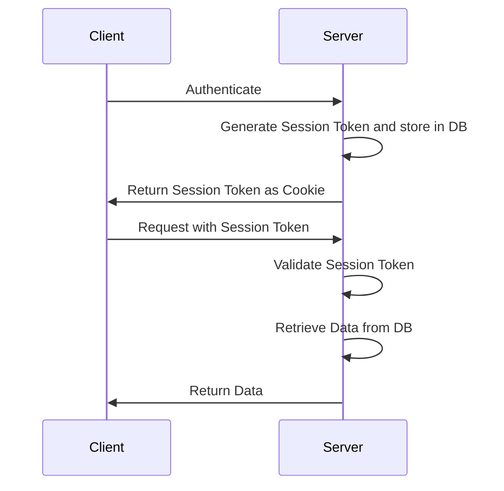

# Session Token

```mermaid
sequenceDiagram
    participant Client
    participant Server

    Client->>Server: Authenticate
    Server->>Server: Generate Session Token and store in DB
    Server->>Client: Return Session Token as Cookie
    Client->>Server: Request with Session Token
    Server->>Server: Validate Session Token
    Server->>Server: Retrieve Data from DB
    Server->>Client: Return Data
```
