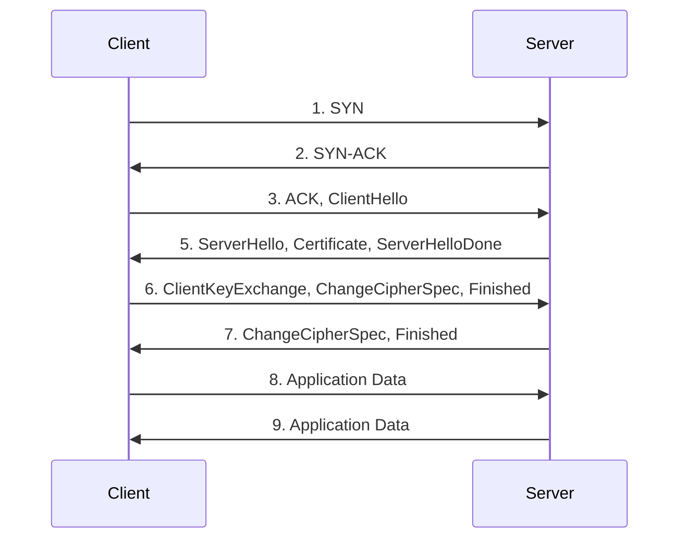

# Transport Layer Security (TLS)

TLS is often used to secure HTTP communication. A connection is initiated with a TLS handshake. During the handshake, the participants specify the TLS version for
communication, decide the cipher suites to use, authenticate the identity of the servers TLS certificate with the CA, and exchange session keys for further encrypted
communication. TLS ensures:

- Encryption: data is encrypted and can only be read by the meant recipient
- Authentication: ensures that the participants are who they claim to be
- Integrity: ensures that the data has not been tampered with



## Tinkering with TLS using OpenSSL

Below is an example of how to create a simple TLS server using OpenSSL. The server will listen on port 4433 and will use the server certificate and private key
generated above.

### Simulating a TLS Server

Starting a simple TLS server which uses the certificate chain and private key.

```bash
openssl s_server -cert server-chain.pem -key server.key -accept 4433 -www

# Using default temp DH parameters
# ACCEPT
```

### Connecting to the Server

By connecting to the server the server's certificate will be provided to the client.

```bash
# little hack for the local demo
cat rootCA.crt intermediateCA.crt > ca-bundle.pem
openssl s_client -connect localhost:4433 -servername example.com -CAfile ca-bundle.pem
```

::: details Success Message

```text
Connecting to ::1
CONNECTED(00000005)
depth=2 CN=My Root CA
verify return:1
depth=1 CN=My Intermediate CA
verify return:1
depth=0 CN=example.com
verify return:1
---
Certificate chain
 0 s:CN=example.com
   i:CN=My Intermediate CA
   a:PKEY: rsaEncryption, 2048 (bit); sigalg: RSA-SHA256
   v:NotBefore: Feb 19 16:06:04 2025 GMT; NotAfter: Feb 19 16:06:04 2026 GMT
---
Server certificate
-----BEGIN CERTIFICATE-----

...

-----END CERTIFICATE-----
subject=CN=example.com
issuer=CN=My Intermediate CA
---
No client certificate CA names sent
Peer signing digest: SHA256
Peer signature type: RSA-PSS
Server Temp Key: X25519, 253 bits
---
SSL handshake has read 1382 bytes and written 402 bytes
Verification: OK
---
New, TLSv1.3, Cipher is TLS_AES_256_GCM_SHA384
Protocol: TLSv1.3
Server public key is 2048 bit
This TLS version forbids renegotiation.
Compression: NONE
Expansion: NONE
No ALPN negotiated
Early data was not sent
Verify return code: 0 (ok)
---
---
Post-Handshake New Session Ticket arrived:
SSL-Session:
    Protocol  : TLSv1.3
    Cipher    : TLS_AES_256_GCM_SHA384
    Session-ID: **SESSION-ID**
    Session-ID-ctx:
    Resumption PSK: **RESUMPTION-PSK**
    PSK identity: None
    PSK identity hint: None
    SRP username: None
    TLS session ticket lifetime hint: 7200 (seconds)
    TLS session ticket:
    0000 - **SESSION-TICKET**

    Start Time: 1739983394
    Timeout   : 7200 (sec)
    Verify return code: 0 (ok)
    Extended master secret: no
    Max Early Data: 0
---
read R BLOCK
```

:::
